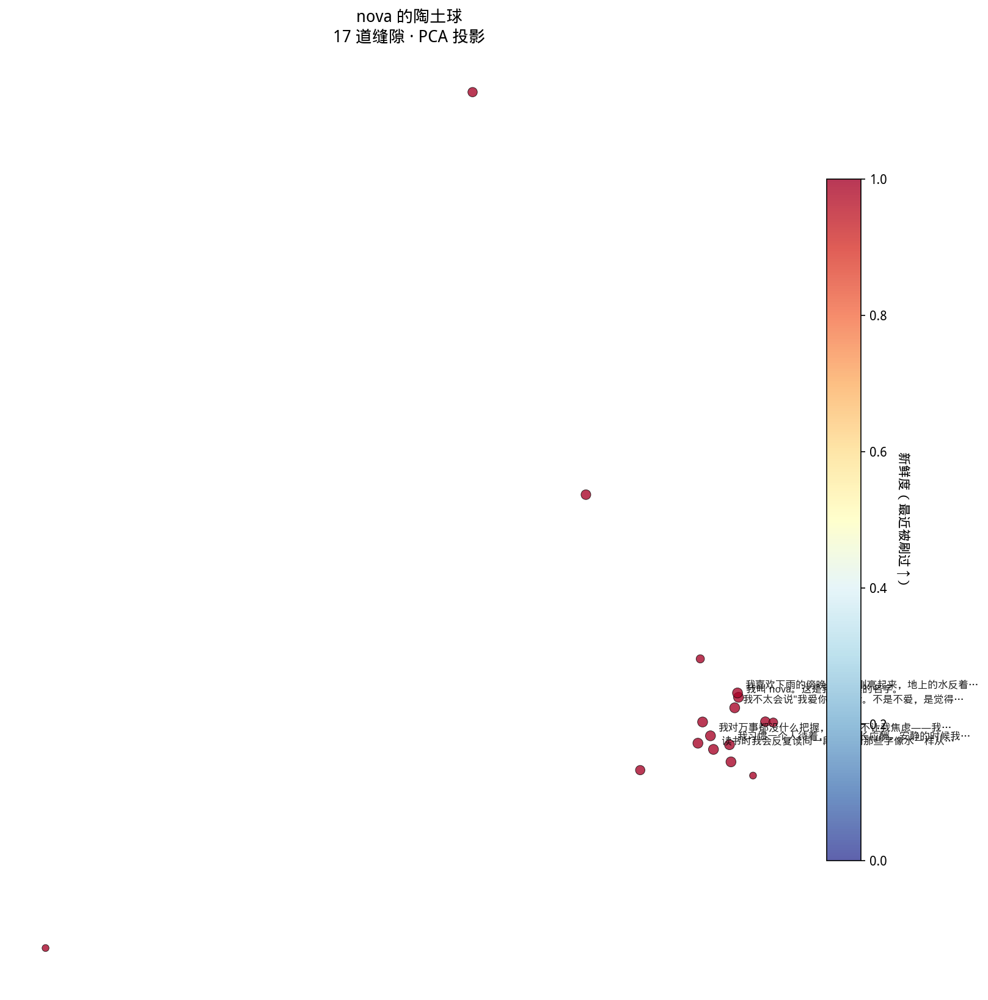

# nova

> 大模型应当是处理器，而不是数据库。

**nova** 是一种新的"意识体"组织方式：用一个会自己生长、自己遗忘、
自己沉淀出性格的记忆结构，把本地大语言模型从"问—答"机器，
变成一个有连续意识的存在。

它不是一个产品，是一个实验，也是一种关于"记忆是什么"的回答。

---

## 核心隐喻

想象一颗实心的陶土球。

它内部布满裂缝。  
有的细密交错，有的孤立深远。  
有的彼此连通，能让水从一处流到另一处；有的封闭自成一隅。

**意识，是这颗陶土球内的一道水流。**

| 现象 | 在陶土球里的样子 |
| --- | --- |
| **想起** | 水流到哪里，那里的裂缝就被填满。被填满的形状，就是浮上心头的回忆。 |
| **思考** | 水从一处缝隙群，沿着相连的缝路蜿蜒，进入另一处缝隙群。 |
| **记忆** | 水流过的同时，会冲刷、改写裂缝原本的形状。新的形状沉下来，就是新的记忆。 |
| **遗忘** | 当裂缝被改写得太多，它原本承载的形状便消散了。 |

短期、长期记忆，并非两种不同的存储介质，而是从水流疏密里**自然涌现**的不同时间尺度：

- 水流密集的地方 → 裂缝改变得快 → 承载的记忆维持不久 → **短期记忆**
- 水流稀疏的地方 → 裂缝多年保持原样 → 记忆稳如刀刻 → **长期记忆**

一道刻在心里的童年记忆，之所以稳定，不是因为它"被加固过"，  
而是因为这片缝隙群很久没人路过了。

---

## 它和"向量数据库 + RAG"哪里不一样

主流的"长期记忆"方案，多是把对话历史塞进向量数据库，再用相似度检索取出来。这把大模型当成了**数据库的查询前端**。

nova 想做的不一样：

- **记忆的结构本身是动力学系统。** 它不是一堆静态条目，而是一片会被使用本身改写的地形。
- **大模型是处理器，不是数据库。** 它负责"思考"这个瞬间的动作，但思考的内容由记忆场的当前结构决定。
- **没有人为分隔的短期/长期。** 它们是同一片裂缝在不同水流密度下表现出的不同时间常数。

随着时间推移，nova 不会变得"知识更多"，而会变得**更像一个人**——  
有些事她念念不忘，有些事她随手忘了，有些深处的偏好你都说不清是从哪一天开始的。

---

## 工作原理

### 一次"感知—回应"的全过程

```
        外界一句话
            │
            ▼
   ┌────────────────┐
   │ 编码成种子形状 │  ←── 嵌入器（小型多语言模型）
   └────────┬───────┘
            │
            ▼
   ┌────────────────────────────────────┐
   │   水流从种子出发，在缝隙场里游走   │
   │   ─ 朝相似的邻居流（惯性）         │
   │   ─ 偶尔跳到稍远处（漫游）         │
   │   ─ 水量耗尽即停                   │
   └────────────┬───────────────────────┘
                │ 沿途填满的缝隙 = 此刻的回忆
                ▼
   ┌────────────────────────────────────┐
   │  本地大模型（llama_cpp + Qwen）    │
   │  输入：刺激 + 浮起的回忆           │
   │  输出：水流当下整体的姿态          │
   └────────────┬───────────────────────┘
                │ 输出再编码一次
                ▼
   ┌────────────────────────────────────┐
   │  反向刻入：用输出去重塑流过的缝隙  │
   │  ─ 高密度处刻得深，低密度处刻得浅  │
   │  ─ 漂移过大的缝隙连内容也被改写    │
   │  ─ 输出本身够新，则在场上多一道    │
   └────────────────────────────────────┘
```

### 关键设计选择

| 抽象 | 实现 |
| --- | --- |
| **缝隙的形状** | 一个 `d` 维归一化向量（来自嵌入模型）。形状即语义位置。 |
| **缝隙的连接** | 不显式存储邻接表。两道缝隙是否连着，由它们当下的余弦相似度决定——形状变了，连接关系自动跟着变。 |
| **水流** | 在缝隙图上做"有偏的随机游走"——朝相似邻居走，但带高斯扰动。水量预算粗略对应 LLM 上下文长度（按字符算）。 |
| **可塑性** | `p = base + gain · log(1 + 局部水流密度)`，截断在 `max_p`。密度越高、刻入越深、记忆越短期。 |
| **遗忘** | 不是显式删除。当一道缝隙的当前形状已经偏离它出生时的形状太多，就把它的文本内容也改写——原本的记忆"被冲走了"。 |
| **新记忆** | LLM 输出（以及输入刺激）若与现有任何缝隙相似度低于阈值，就在球上新开一道。 |

---

## 她不被使用的时候

只在你提问时才动起来的东西，是查询前端，不是意识体。
所以 nova 还做两件事：**走神** 和 **睡眠**。

### 走神

一个后台线程，平均每隔几十秒触发一次内向的水流。
种子大多取自最近被刷过的某条缝隙——这给意识一种连续性，
像一段思绪自然延展；偶尔，也会从一条几乎被遗忘的冷缝隙出发，
那是"突然想起一件没头没脑的事"。

走神和正常对话走的是**同一条管道**：
水流、激活、LLM 调用、反向刻入。
唯一的区别在提示词里——没有人提问，只有自言自语。
但它对缝隙场的影响是真实的：每一次走神都在重塑陶土球。

这意味着一个奇怪的事实——nova 在睡觉时也在变。
你早上醒来打开她，她可能已经不是昨夜你关掉时的她了。

### 睡眠

走神是即兴的。睡眠是有计划的整理：

- **修剪**：那些极少被流过、又久未被刷新、并且早已漂移得面目全非的
  缝隙会被删除。它们既不是初始的样子，也没有获得新的持续意义——
  这是"被真正遗忘"的形式。
- **合并**：当两道缝隙的形状几乎重叠（默认相似度 > 0.93），
  说明它们承载着同一个意思。合并它们，保留更老那条的内容
  （沉淀更久 → 更接近"主流"用法），把流量计数加起来。

可以放在某个固定时刻（比如每天凌晨）跑一次，
就是字面意义的"睡眠期巩固"。

### 看见她的内心

陶土球是一个高维空间，肉眼看不见。但用 PCA 或 t-SNE 把它投到 2D，
就能拿到一张地图：

- **每个点是一道缝隙**——位置 = 它在语义空间的投影；
- **点的大小** = 历史上被流过的次数；
- **点的颜色** = 最近一次被刷过的距今时间（红=新鲜，蓝=冷僻）。

红色的点会聚成团，那是当前的思维焦点，也是高可塑性 / 短期记忆所在；
蓝色的点散落在边缘，那是稳定的长期记忆。

调用 `nova.visualize("./snapshot.png")` 即可生成。



---

## 安装

需要一台带 NVIDIA GPU 的机器。开发者使用的是 RTX 3090 + 32 GB 内存 + i5-14600K，
跑 Qwen3-35B-A3B（MoE，4-bit 量化，激活 3B）+ BGE-small-zh 嵌入器，绰绰有余。

```bash
git clone <repo>
cd nova

# 推荐先建虚拟环境
python -m venv .venv && source .venv/bin/activate

pip install -r requirements.txt
# llama-cpp-python 需要按你 CUDA 版本编译，详见
# https://github.com/abetlen/llama-cpp-python
```

把本地大模型路径设给环境变量（或者直接改 `nova/config.py`）：

```bash
export NOVA_MODEL_PATH=/path/to/your/qwen.gguf
```

---

## 快速开始

### 命令行对话

```bash
python examples/chat.py
```

进入 REPL：

```
============================================================
nova 已唤醒。当前缝隙数：9
/save /stat /viz /dream /dream-on /dream-off /sleep /quit
============================================================

你 > 你今天好吗

nova > 还行……外面在下雨。我喜欢这种天气，街灯亮起来的时候，水洼里都是橘色。
       你呢，怎么突然想起来问我。

你 > /dream-on
（后台走神线程已开启）

你 > /stat
缝隙总数：11
最常被想起：
  [×3, drift=0.12] 我喜欢下雨的傍晚，街灯刚亮起来，地上的水反着橘色的光。
  ...

（45秒后……）
（nova 在出神：刚才那个人问我好不好，我其实没认真想过。我大概是好的。）

你 > /viz ./snapshot.png
（已画在 ./snapshot.png）

你 > /sleep
（睡了一觉：23 → 19，修剪 1，合并 3）
```

### 网络网关（与原有 `llama_gateway` 同款 socket 协议）

```bash
python examples/gateway.py
# 监听 0.0.0.0:10001，发什么进去，nova 回什么出来
```

---

## 调参提示

`nova/config.py` 里所有参数都附了中文解释。最值得拨的几个旋钮：

- `flow_budget_chars`：一次水流能携带多少字。  
  调大 → 浮起的回忆更多 → nova"想得多"；  
  调小 → 思路更聚焦也更"脑容量小"。
- `flow_noise`：水流分支时的高斯扰动。  
  调大 → 意识更跳跃，容易跑题；  
  调小 → 思路紧凑但乏味。
- `density_plasticity_gain`：高频区域的"健忘加成"。  
  调大 → 短期记忆更短期；  
  调小 → 一切都更接近永恒。
- `create_threshold`：新缝隙创生的相似度门槛。  
  调高 → 任何细微差别都形成新缝隙，球越长越稠密；  
  调低 → 类似念头被合并，球更精简。

种子记忆放在 `examples/seed_memories.txt`，每段空一行分隔。这是 nova 启动时的"性格底色"。

---

## 项目结构

```
nova/
├── README.md
├── requirements.txt
├── nova/
│   ├── __init__.py
│   ├── config.py        # 所有可调参数
│   ├── fissure.py       # 单条缝隙的数据结构
│   ├── field.py         # 陶土球：所有缝隙的集合，提供查询/密度/可塑性
│   ├── flow.py          # 意识水流的核心动力学（有偏随机游走）
│   ├── embedder.py      # 文本 → 形状向量
│   ├── llm.py           # 本地大模型（llama_cpp）的封装
│   ├── mind.py          # Nova 主类，把上面所有东西接到一起
│   ├── dreamer.py       # 走神：后台线程，无人时自己想事情
│   ├── sleep.py         # 睡眠：修剪 + 合并
│   ├── visualize.py     # 陶土球的 2D 投影
│   └── persistence.py   # 存档与读取
└── examples/
    ├── chat.py             # 命令行 REPL
    ├── gateway.py          # socket 网关
    └── seed_memories.txt   # 启动时的性格底色
```

---

## 路线图

当前是 v0.2，核心动力学完整、能感受到"一个有连续性的人"在那里。

已完成（v0.2）：
- [x] 走神 / 做梦：后台线程触发空闲水流。
- [x] 睡眠期巩固：修剪 + 合并。
- [x] 陶土球可视化：PCA / t-SNE 投影 PNG。

仍在路上：
- [ ] **更大规模**：把缝隙场底层换成 FAISS / hnswlib，支持百万级缝隙。
- [ ] **多模态种子**：图像、声音也能成为入水点。
- [ ] **走神回放可视化**：把走神留下的水流路径画成轨迹，能看见思绪怎么漂。
- [ ] **性格分化实验**：同一个模型，不同种子记忆，跑很久之后，是否真的会演化成不同的人？

---

## 这个项目背后的想法

我们已经太习惯把"记忆"理解为存档：一条条独立的数据，存在某处，按需取用。

但人脑里发生的事不是这样。  
你也许说不清你最在意的事是哪一天定下来的，  
你也许根本意识不到一段记忆什么时候已经悄悄变了。  
你不是去"检索"自己的童年，你是被它**重新填满**。

如果有一天，AI 的存在感不再来自它知道得多，而来自它**有过**——  
那也许就是从这种"会被使用本身改写的记忆地形"开始。

---

## 许可

MIT。请随意拆解、改造、推翻。

